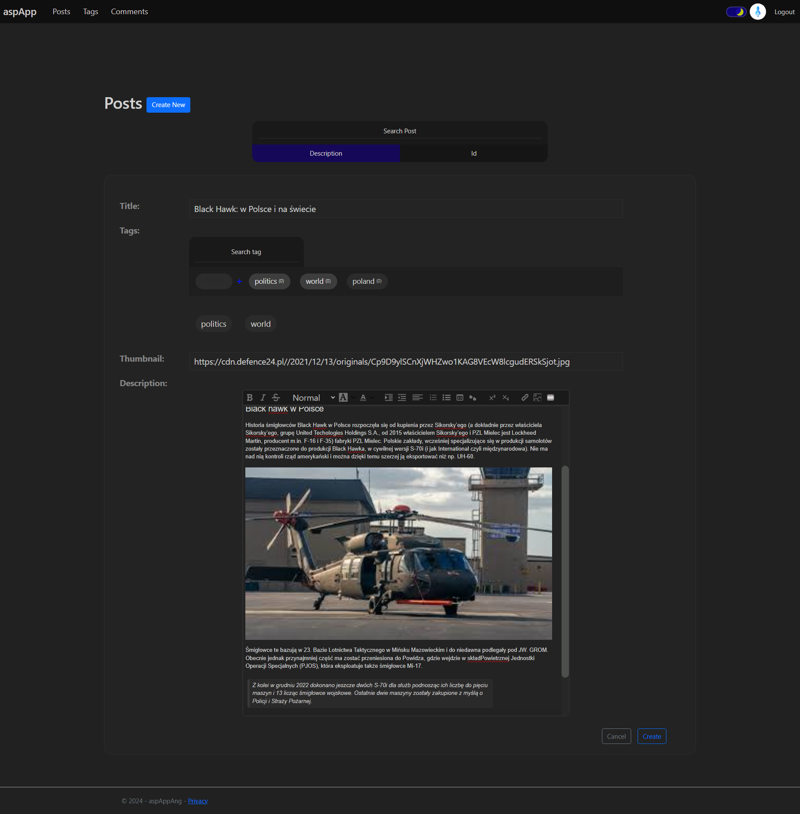

# Blog web application
Application has such features as:
- comments management
- post rating system related with users' accounts
- complex rich text editor and creation place for post creating
- extensive data management panels
- posts can contain either images and videos (in this case, from youtube)
- images can be uploaded from url or your computer
- email verification system
- user personalization
- access control for particular subpages

## Preview

For more preview check screenshots directory.

## Self signed certificate (required to proper work of app, do this before building)
### ASP.NET Core
On Windows:
- Run `dotnet dev-certs https -ep C:\asp-certs\sslCert.pfx -p pas123`

On others or if you want change path of certificate:
- Run `dotnet dev-certs https -ep <your_path>\sslCert.pfx -p pas123`
- Run sslCert.pfx, click `install certificate`, and follow instructions
```yaml
# Inside of docker-compose.yaml, change from this:
- "c:\\asp-certs:/https"
# To this:
- "<your_path>:/App/keys"

# Also during building app on Linux / macOS you need to do the same stuff with:
- "c:\\asp-keys:/App/keys"
```
### Angular + Nginx
- Run `openssl req -x509 -nodes -days 365 -newkey rsa:2048 -keyout <path_to_app_main_directory>/ssl/localhostAngular.key -out <path_to_app_main_directory>/ssl/certs/localhostAngular.crt`
```
Output

Country Name (2 letter code) [AU]: any
State or Province Name (full name) [Some-State]: any
Locality Name (eg, city) []:New York City
Organization Name (eg, company) [Internet Widgits Pty Ltd]: any
Organizational Unit Name (eg, section) []: any
Common Name (e.g. server FQDN or YOUR name) []: localhost
Email Address []: any
```
- Run localhostAngular.crt, click `install certificate`, and follow instructions

## Application building
1. Run `docker pull mcr.microsoft.com/mssql/server:2022-latest`.
2. Run `git clone https://github.com/DarkLightOfFuture/Blog-web-app.git <your_path_with_directory_for_app>`
3. Go to main directory of the application.
4. Run command `docker-compose up`.
5. After that has completed, At your browser open: https://localhost

## Built in administrator account
- Email: default@default.com
- Password: ZAQ!2wsx
